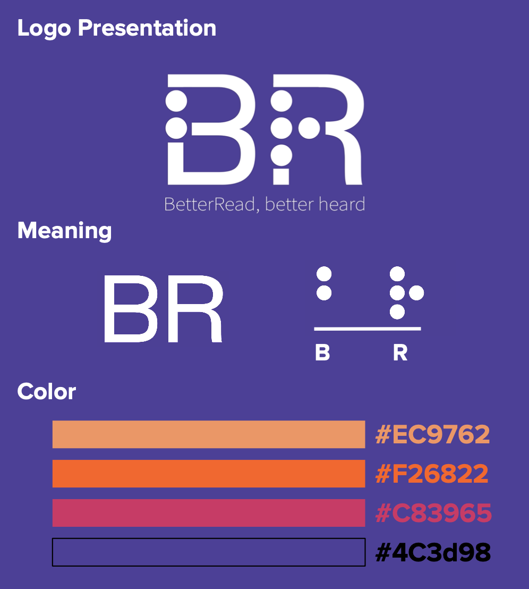

# User Interface Specifcation

## Branding

### Logo Design
- Simple, clean, and straightforward
- ‘B’ and ‘R’ from BetterRead name
- Incorporated braille for B and R
 
 ## Extension Interface 
 
 ### Keyboard Shortcut
 
The extension is primarly controlled via a keybaord shortcut, because we thought it would be easier and more convinent to use for our users. It was important to us that this keyboard shortcut was able to be edited by the user to whatever was most comfortable 

There are two other components of the extension the user can interact with, the popover, and the options page. With these pages, it was more important to use semantic HTML and recognizable/common elements than styling. Function over form was key with this project. 

Extension popover

Extension options

